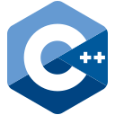

  
  <h1>Ciao, sono Denilson</h1>
 <h3><strong><a href="https://github.com/denilson-projects/open-tagada">OPEN TAGADÀ</a></strong> Realizza un tagadà da 0, 110% open-source</h3>
   

  
  <h3><i>Le mie Skills</i></h3>
  
  
  
  
   

